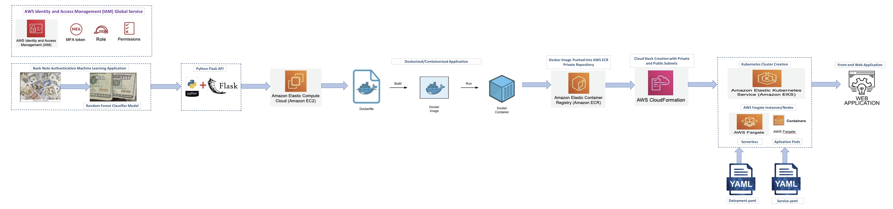

# productionized_docker_ML_model_application_into_kubernetes_cluster_using_AWS_EKS_CloudFormation_EMR

This project covers the end to end implementation of deploying and productionizing a dockerized/containerized machine learning python flask application into Kubernetes Cluster using the AWS Elastic Kubernetes Service (EKS), AWS Serverless Fargate Instances, AWS CloudFormation Cloud Stack and AWS Elastic Container Registry (ECR) Service.  

The machine learning business case implemented in this project includes a bank note authentication binary classifier model using Random Forest Classifier; which predicts and classifies a bank note either as a Fake Bank Note (Label 0) or a Genuine Bank Note (Label 1).  

Project Architecture:

Implementation Steps:  

1. Creation of an end to end machine learning solution covering all the ML life-cycle steps of Data Exploration, Feature Selection, Model Training, Model Validation and Model Testing on the unseen production data. 
2. Saved the finalised model as a pickle file. 
3. Creation of a Python Flask based API; in order to render the ML model solution and inferences to the end-users. 
4. Verified and tested the working status of the Python Flask API in the localhost set-up. 
5. Creation of a Docker File (containing the steps/instructions to create a docker image) for the Python Flask based Bank Note Authentication Machine Learning Application embedded with Random Forest ML Classifier Model. 
6. Creation of IAM Service Roles with appropriate policies to access the AWS Elastic Container Registry (ECR) Service and AWS Elastic Kubernetes Service (EKS) and AWS CloudFormation Service. 
7. Created a new EC2 Linux Server Instance in AWS and copied the web application project’s directories and its files into the AWS Linux Server using SFTP linux commands. 
8. Installed the Docker software and the supporting python libraries in the AWS EC2 Linux Server Instance; as per the “requirements.txt” file. 
9. Transformation of the Docker File into a Docker Image and Docker Container representing the application; using docker build and run commands. 
10. Creation of a Docker Repository within the AWS ECR Service and pushed the application docker image into the repository using AWS Command Line Interface (CLI) commands. 
11. Creation of the Cloud Stack with private and public subnets using the AWS CloudFormation Service with appropriate IAM roles and policies. 
12. Creation of the Kubernetes Cluster using the AWS EKS Service with appropriate IAM roles and policies and linked the cloud stack created using the AWS CloudFormation Service. 
13. Creation of the AWS Serverless Fargate Profile and Fargate instances/nodes. 
14. Creation and configured the “Deployment.yaml” and “Service.yaml” files using the Kubernetes kubectl commands. 
15. Applied the “Deployment.yaml” with pods replica configuration to the AWS EKS Cluster Fargate Nodes; using the Kubernetes kubectl commands. 
16. Applied the “Service.yaml” using the Kubernetes kubectl commands; to render and service the machine learning application to the end-users for public access with the creation of the production end-point. 
17. Verified and tested the inferences of the productionized ML Application using the AWS Fargate end-point created in the AWS Kubernetes EKS Cluster.  

Tools & Technologies: 
1. Python
2. Flask
3. AWS
4. AWS EC2
5. Linux Server
6. Linux Commands
7. Command Line Interface (CLI)
8. Docker
9. Docker Commands
10. AWS ECR
11. AWS IAM
12. AWS CloudFormation
13. AWS EKS
14. Kubernetes
15. Kubernetes kubectl Commands
